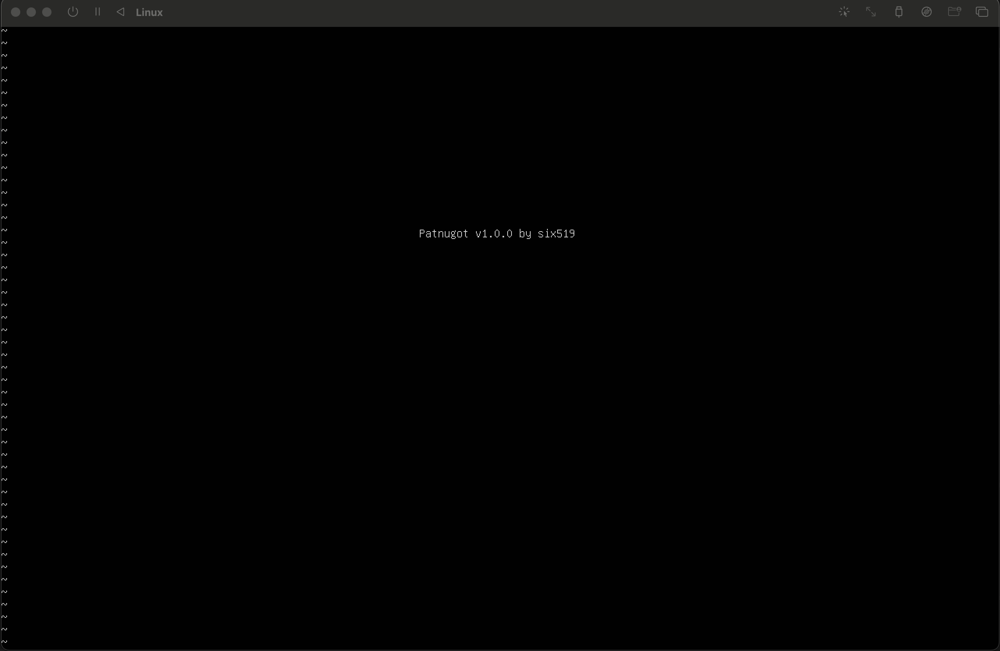

# Patnugot

A text editor for x64 Linux, written in assembly language and inspired by the [Kilo](https://github.com/antirez/kilo) project.

## Dependencies

- nasm
- gcc
- make
- binutils

## How to build

```bash
make
```

### Screenshot

